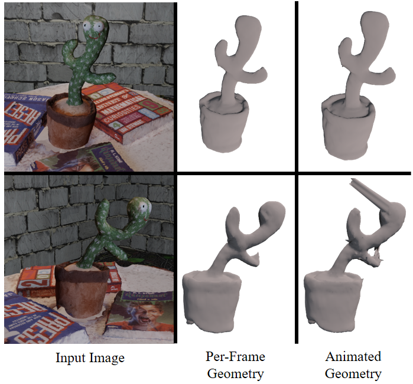
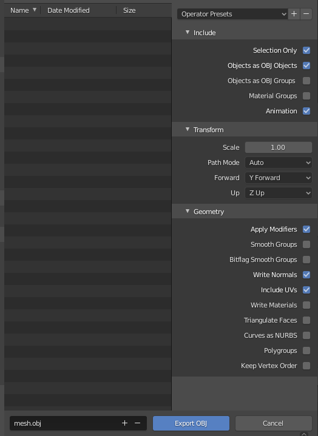

# **Ub4D** 
## ArXiv 2022 | [🌐Project Page](https://4dqv.mpi-inf.mpg.de/Ub4D/) | [📝Paper](https://arxiv.org/pdf/2206.08368.pdf) | [🎥Video](https://youtu.be/uu3ueYgsHxE) | [💾Data](https://drive.google.com/drive/folders/1lFhLqeNjslqgIuRpQnUlHbd5-56vaDNE?usp=sharing)
We propose a novel approach to the problem of non-rigid surface reconstruction through the use of a deformable neural implicit scene model and a rendering method that is provably unbiased to the object surface, even for bent rays. Our method, called Ub4D, is described in the paper **Unbiased 4D: Monocular 4D Reconstruction with a Neural Deformation Model**. <br>
[Erik C.M. Johnson](https://www.ecmjohnson.com/)<sup>1,2</sup>,
[Marc Habermann](https://people.mpi-inf.mpg.de/~mhaberma/)<sup>1</sup>,
[Soshi Shimada](https://people.mpi-inf.mpg.de/~sshimada/)<sup>1</sup>,
[Vladislav Golyanik](https://people.mpi-inf.mpg.de/~golyanik/)<sup>1</sup>
[Christian Theobalt](http://people.mpi-inf.mpg.de/~theobalt/)<sup>1</sup> <br>
<sup>1</sup>MPI Informatics, <sup>2</sup>Saarland Informatics Campus


## Setup

Clone this repository:
```shell
git clone https://github.com/ecmjohnson/Ub4D.git
cd Ub4D
```

Download the data and place it in a folder named `public_data` within the repo. The data location is specified in the configuration file `data_dir` under `dataset` (i.e. `./public_data/CASE_NAME/` for the provided configs). For running the provided configs, the pathing should be:
```
Ub4D
|-- public_data
    |-- Cactus
        ...
    |-- Humanoid
        ...
    |-- Lego
        ...
    |-- RealCactus
        ...
    |-- RootTrans
        ...
...
```

Install the requirements:
<details>
    <summary>Windows (CUDA 10.2)</summary>

    ```shell
    conda env create -f conda_env_windows.yml
    ```
</details>

<details>
    <summary>Linux (CUDA 11.1)</summary>

    ```shell
    conda env create -f conda_env_linux.yml
    ```
</details>

<details>
    <summary>Requirement list</summary>

    Python 3.8 and:

    ```
    numpy
    pytorch
    opencv
    trimesh
    pymcubes
    imageio
    tqdm
    tensorboard
    pyhocon
    scipy
    scikit-learn
    matplotlib
    pyrender
    ```
    
    (Note: `matplotlib`, `scipy`, `scikit-learn`, and `pyrender` are only required for our post-processing script `exp_post.py` and could be removed if they cause trouble)
    (Note: `ffmpeg` available in your path is required to generate videos from image sequences as part of post-processing)
</details>

Activate the environment (if using Conda):
```shell
conda activate ub4d
```

## Running

We use the *Cactus* scene and its corresponding provided config file as an example. Running these commands should recreate the gif below (note that some variation is possible due to unseeded RNG). For other scenes, replace the `--case` with the dataset name and the `--conf` with an appropriate config file.


1. **Training**

```shell
python exp_runner.py --mode train --conf ./public_confs/Cactus.conf --case Cactus
```

This creates and populates the folder specified in `base_exp_dir` under `general` in the config file (i.e. `exp/cactus/paper_config` in the above case). Directory should contain:
<details>
    <summary>Training output directories</summary>

    ```
    <base_exp_dir>
    |-- checkpoints # saved state; frequency specified by save_freq under train in config file
        ...
    |-- logs # tensorboard logs; frequency specified by report_freq under train in config file
        ...
    |-- meshes # validation meshes; frequency specified by val_mesh_freq under train in config file (note: this visualizes the canonical space, not any frame!)
        ...
    |-- normals # validation normal image; frequency specified by val_freq under train in config file
        ...
    |-- pointclouds # validation termination pointcloud (only points with sufficient segmentation value; see code for further details); frequency specified by val_freq under train in config file
        ...
    |-- recording # backup of all python scripts and config file
        ...
    |-- validations_fine # validation RGB image; frequency specified by val_freq under train in config file
        ...
    ```
</details>

2. **Extract mesh sequence from trained model**

If meshes are provided in the dataset (e.g. synthetic scenes), `--full_scene_bounds` can be omitted and `--mcube_resolution` reduced since this limits the marching to a slightly expanded bounding box of the mesh vertices. This expansion factor is controlled by `bbox_expansion` under `dataset` in the config file.

```shell
python exp_runner.py --mode mesh_sequence --conf ./public_confs/Cactus.conf --case Cactus --is_continue --full_scene_bounds --frustum_cull --mcube_resolution 1024
```

This saves every frame as an individual mesh in one of the following directories:
* `'full_scene_{:08d}'.format(iteration)` if `--full_scene_bounds`
* `'custom_{:08d}'.format(iteration)'` if `--custom_bounds` (see the code for specifying custom marching bounds)
* `'meshes_{:08d}'.format(iteration)` otherwise

3. **Post-process the results**

This assumes both of the above steps ran successfully. Many features require `matplotlib` to be installed, but quantitative metrics can be computed without it. Add `--skip_render` if `pyrender` or `scipy` are not installed (or running on a headless system without an appropriately built `pyrender`). Add `--skip_latents` if `scikit-learn` is not installed. It works better with `ffmpeg` available in the path.

```shell
python exp_post.py --conf ./public_confs/Cactus.conf --case Cactus
```

If ground truth meshes are available in the data directory, then for every possible output mesh directory this adds a subdirectory of meshes named `errors` which recolors each vertex with the distance to the ground truth. In this case it also adds quantitative metrics in `summary.txt`, `metrics.csv`, and `metrics.npy`.

If not specifying `--skip_render`, then for every possible output mesh directory, this adds subdirectories that contain renderings of the meshes from various possible perspectives. The relevant options are `--render_novel` and `--render_view <view_index>`. The name of the subdirectory is adjusted to be unique to the combination provided and a video is created in the subdirectory if `ffmpeg` is available in the path. Additionally, if neither `--render_novel` nor `--render_view` are specified, a subsubdirectory is created called `overlay` that overlays the renderings on the original input images.

If not specifying `--skip_latents`, an additional directory named `latent_analysis` will be created which visualizes the latent codes in every checkpoint. If the latent codes are of a higher dimension than 2, this will be a PCA projection based on the final latent code state. This allows a stable comparison and we therefore also produce an animation showing the evolution of the latent codes over training.

4. **Create the grid video visualization**

We include a grid video utility for easily generating comparisons. This will only work if images were rendered in the step above. Run `python utils/grid_vid.py --help` or see [`utils/grid_vid.py`](utils/grid_vid.py) for full usage information. Note that the directories are specified in row-major order.

```shell
python utils/grid_vid.py ./public_data/Cactus/train/ ./exp/Cactus/paper_config/full_scene_00300000/cam/overlay/ ./exp/Cactus/paper_config/cam_color/ ./exp/Cactus/paper_config/full_scene_00300000/errors/cam/ --nrows 1 --ncol 4 --output ./exp/Cactus/paper_config/1x4/
```

This command recreates the sequence shown at the start of the section in the folder `./exp/Cactus/paper_config/1x4/` assuming everything worked. A video and gif are also produced (i.e. `vid.mp4` and `vid.gif`) if `ffmpeg` is available in the path.

* (Optional) **Render camera and novel views**

Renders RGB images, normals images, and outputs termination pointclouds for camera and novel views.

```shell
python exp_runner.py --mode validate_sequence --conf ./public_confs/Cactus.conf --case Cactus --is_continue
python exp_runner.py --mode novel_sequence --conf ./public_confs/Cactus.conf --case Cactus --is_continue
```

Outputs camera validation results in `'sequence_{:08d}'.format(iteration)` directory and novel view results in `'novel_{:08d}'.format(iteration)` directory.

* (Optional) **Animate the canonical space**

Animates the mesh created by marching in the canonical space by solving an optimization problem (see code for further details). This could allow extracting 3D correspondences, but it fails dramatically for large deformations (see figure below). Maybe simultaneously training an inverse bending network via cycle-consistency would work...

```shell
python exp_runner.py --mode animate_canonical --conf ./public_confs/Cactus.conf --case Cactus --is_continue
```

This saves every animated result as an individual mesh in one of the following directories:
* `'animfull_scene_{:08d}'.format(iteration)` if `--full_scene_bounds`
* `'animcust_{:08d}'.format(iteration)` if `--custom_bounds` (see the code for specifying custom marching bounds)
* `'animated_{:08d}'.format(iteration)` otherwise



## Configuration

The config file contains important hyperparameters under `train`:
* `end_iter`: number of iterations for which to run; further experiments indicate values lower than the paper's 450000 are better
* `igr_weight`: weight for Eikonal loss (L_EIK)
* `mask_weight`: weight for segmentation loss (L_SEG)
* `offset_weight`: weight for neighbour offset loss (L_NBR)
* `divergence_weight`: weight for divergence loss (L_DIV)
* `flow_weight`: weight for scene flow loss (L_FLO)
* `bending_increasing`: use exponential 1/100 increasing bending penalizers (default is true)
* `flow_decreasing`: use exponential 1/10 decreasing flow loss (default is true)

Additionally, the construction of the system can be modified by changing the network hyperparameters under `model`. Note that the `nerf` model is only relevant when outside samples are used which is not done for any of our scenes. This will likely be relevant when extending to remove the necessity of supplying segmentation images.

Specifically interesting are the following under `bending_network`:
* `latent_dim`: dimension of the latent codes used; further experiments indicate values lower than the paper's 64 are better
* `zero_init`: initializes the latent codes with zeroes (default is true); interesting to show the significance of the zero initialization

## Data Formats

We accept three different data formats:
* [NeRF Blender format](https://github.com/bmild/nerf) (e.g. exported with our [Blender add-on](https://gist.github.com/ecmjohnson/33b05aa97c623968706fe32c8e2db8e6)),
* [LLFF](https://github.com/Fyusion/LLFF) (also used in [NR-NeRF](https://github.com/facebookresearch/nonrigid_nerf)), and
* [IDR](https://github.com/lioryariv/idr) (also used in [NeuS](https://github.com/Totoro97/NeuS)).

The NeRF Blender format and LLFF are the primary formats, with IDR only used for regression testing.

### NeRF Blender format (recommended for synthetic experiments)

This format is described in [NeRF](https://github.com/bmild/nerf) and we use our [Blender add-on](https://gist.github.com/ecmjohnson/33b05aa97c623968706fe32c8e2db8e6) to output the data. It is typically used for synthetic scenes to demonstrate the method capabilities and uses ground truth camera parameters.

One can also export meshes from Blender for use with the scene flow loss or as ground truth. These are also used to compute segmentations, although this could likely be added to the Blender add-on. Note that we use the following settings (note especially the changed orientation to match our convention!):



The relevant parts of the dataset are:
```
<case_name>
|-- transforms_train.json # camera parameters for training images
|-- novel_view.json # camera parameters for novel views
|-- train # RGB images
    |-- 0001.png # note 1-indexed naming
    |-- 0002.png
    ...
|-- test # empty folder; no testing set for this problem
|-- val # empty folder; no validation set for this problem
|-- segmentations # segmentation images (must be same size as RGB images!)
    |-- 0001.png # corresponds to RGB image 0001.png
    |-- 0002.png # corresponds to RGB image 0002.png
    ...
|-- meshes # optional! estimated meshes used for the scene flow loss
    |-- mesh_000001.obj # corresponds to RGB image 0001.png (note 1-indexed naming)
    |-- mesh_000002.obj # must have same number of corresponding vertices as mesh_000001.obj
    ...
|-- gt_meshes # optional! ground truth meshes for quantitative comparison
    |-- mesh_000001.obj # corresponds to RGB image 0001.png (note despite naming this differs from the above)
    |-- mesh_000002.obj # corresponds to RGB image 0002.png
    ...
```

In the config file under `dataset` set `data_type = nonrigid` and `nonrigid_type = blender`. Ensure a `bending_network` section is included under `model`.

### LLFF (recommended for real-world captures)

This format is described in [NR-NeRF](https://github.com/facebookresearch/nonrigid_nerf) and in [LLFF](https://github.com/Fyusion/LLFF). It is typically used for a real-world scene where the camera parameters must be estimated with [COLMAP](https://demuc.de/colmap/). Unfortunately, we do not provide a pre-processing utility, but rather refer to that of [NR-NeRF](https://github.com/facebookresearch/nonrigid_nerf).

While [NR-NeRF](https://github.com/facebookresearch/nonrigid_nerf) always uses the full images when running [COLMAP](https://demuc.de/colmap/), we sometimes remove keypoints on the non-rigid object by providing dilated and inverted segmentations (see `colmap` directory in the *RealCactus* dataset and note that we allow all matches during the static portion of the capture). This keypoint removal is implemented in [COLMAP](https://demuc.de/colmap/) and we simply add `--ImageReader.mask_path <path_to_dilated_inverted_segmentations>` when running the `feature_extractor` (take care that the masks are named appropriately! - i.e. same as the RGB images, but with added `.png` extension, even if they are already PNG files).

The relevant parts of the dataset are:
```
<case_name>
|-- poses_bounds.npy # output from pre-processing
|-- images # RGB images
    |-- 0001.png # note 1-indexed naming
    |-- 0002.png
    ...
|-- images_1 # same RGB images again
    |-- 0001.png
    |-- 0002.png
    ...
|-- segmentations # segmentation images (must be same size!)
    |-- 0001.png # corresponds to RGB image 0001.png
    |-- 0002.png # corresponds to RGB image 0002.png
    ...
|-- meshes # optional! estimated meshes used for the scene flow loss
    |-- mesh_000001.obj # corresponds to RGB image 0001.png (note 1-indexed naming)
    |-- mesh_000002.obj # must have same number of corresponding vertices as mesh_000001.obj
    ...
|-- gt_meshes # optional! ground truth meshes for quantitative comparison
    |-- mesh_000001.obj # corresponds to RGB image 0001.png (note despite naming this differs from the above)
    |-- mesh_000002.obj # corresponds to RGB image 0002.png
```

In the config file under `dataset` set `data_type = nonrigid` and `nonrigid_type = llff`. Ensure a `bending_network` section is included under `model`.

### IDR

This format is described in some detail in [NeuS](https://github.com/Totoro97/NeuS) and in further detail in [IDR data convention](https://github.com/lioryariv/idr/blob/main/DATA_CONVENTION.md). It is typically used for a real-world, rigid objects; however, the bending network can be used with this data format. This allows a simple regression test (bending network should remain non-bending during training).

In the config file under `dataset` omit both `data_type` and `nonrigid_type` (default is IDR format). If `bending_network` is under `model`, then the bending network will be used even though the data will be multi-view of a rigid object.

## Reproducibility

Unfortunately, results from the paper or results given in this README are not directly reproducible due to variabilities in PyTorch between versions, operating systems, etc. We offer the ability to provide a random seed; however, this is not sufficient to reproduce results across different systems and setups. While results will be similar between equivalent runs, they will not be identical and no analysis into the degree of variation is conducted.

## Citation

```
@article{johnson2022ub4d,
	title={Unbiased 4D: Monocular 4D Reconstruction with a Neural Deformation Model}, 
	author={Erik C.M. Johnson and Marc Habermann and Soshi Shimada and Vladislav Golyanik and Christian Theobalt},
	year={2022},
	journal={arXiv:2206.08368}
}
```

## Acknowledgement

This work builds upon the excellent works of [NeuS](https://github.com/Totoro97/NeuS), [NR-NeRF](https://github.com/facebookresearch/nonrigid_nerf), [IDR](https://github.com/lioryariv/idr), [NeRF](https://github.com/bmild/nerf), and [NeRF-pytorch](https://github.com/yenchenlin/nerf-pytorch); and is licensed consistently with these works. We truly stand on the shoulders of giants.
